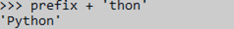

# Instalasi dan Penggunaan Interpreter Python
> Pertemuan Minggu 01 

Dalam pertemuan minggu 1 ini membahas tentang diantaranya adalah python dan penggunaan interpreter Python.

## Bab 1 : Python

Python merupakan bahasa pemrograman tinggi yang bisa melakukan eksekusi sejumlah instruksi multi guna secara langsung (interpretatif) dengan metode Object Oriented Programming dan juga menggunakan semantik dinamis untuk memberikan tingkat keterbacaan syntax. Python menggunakan metode pemrosesan interpreted, dimana kode program akan diproses baris per baris langsung dari kode program (tidak butuh proses compile).


## Bab 2 : Penggunaan Interpreter Python


1. Membuka cmd, ketikkan  perintah ```python```

    

2. saat memasuki konstruksi multi-baris diperlukan  Garis lanjutan. Sebagai contoh, lihat pernyataan ini:

    ```>>> the_world_is_flat = True```

    ```>>> if the_world_is_flat:```

    ```...     print("Be careful not to fall off!")```

    ```...```

    ```Be careful not to fall off!```

    

## Bab 3 : Pengantar Informal untuk Python

  ### 3.1. Menggunakan Python sebagai

    ## 3.1.1. angka 

-  interpreter bertindak sebagai kalkulator sederhana: 
Sintaks operator :  +, -, *dan / bekerja seperti kebanyakan bahasa lain (misalnya, Pascal atau C); tanda kurung ( ()) dapat digunakan untuk pengelompokan. 
Sebagai contoh:


- Division atau pembagian( /) selalu mengembalikan float. Untuk melakukan pembagian lantai dan mendapatkan hasil bilangan bulat (membuang hasil pecahan apa pun),dapat menggunakan // operator; untuk menghitung sisanya, dapat menggunakan %:


- Dengan Python, dimungkinkan untuk menggunakan operator untuk menghitung kekuatan :


- Tanda sama dengan (=) digunakan untuk memberikan nilai pada variabel :


- Jika suatu variabel tidak "didefinisikan" (diberi nilai), mencoba menggunakannya akan memberikan error atau kesalahan: 

 
- operator dengan operan tipe campuran mengubah operan integer menjadi floating point:
 
 
- Dalam mode interaktif, ekspresi tercetak terakhir ditetapkan ke variabel. Ini berarti bahwa ketika Anda menggunakan Python sebagai kalkulator meja, akan lebih mudah untuk melanjutkan perhitungan, misalnya:
 


##

    ## 3.1.2. String

- Selain angka, Python juga dapat memanipulasi string, yang dapat diekspresikan dalam beberapa cara. Mereka dapat diapit oleh tanda kutip tunggal ( '...') atau tanda kutip ganda ( "...") dengan hasil yang sama 2. \ dapat digunakan untuk menghindari kutipan:
  

- Dalam interpreter interaktif, string keluaran diapit oleh tanda kutip dan karakter khusus diloloskan dengan garis miring terbalik. Meskipun ini terkadang terlihat berbeda dari input (tanda kutip terlampir dapat berubah), kedua string tersebut setara. String diapit dalam tanda kutip ganda jika string berisi tanda kutip tunggal dan tidak ada tanda kutip ganda, selain itu diapit dalam tanda kutip tunggal. Fungsi ini print()menghasilkan keluaran yang lebih mudah dibaca, dengan menghilangkan tanda kutip terlampir dan dengan mencetak karakter khusus dan karakter khusus.

- Jika Anda tidak ingin karakter yang diawali dengan \ ditafsirkan sebagai karakter khusus, Anda dapat menggunakan string mentah dengan menambahkan r sebelum kutipan pertama:
 
- String literal dapat menjangkau beberapa baris. Salah satu caranya adalah menggunakan tanda kutip tiga: """..."""atau '''...'''. Akhir baris secara otomatis disertakan dalam string, tetapi Anda dapat mencegahnya dengan menambahkan a \ di akhir baris. Contoh berikut:
 
  menghasilkan output berikut (perhatikan bahwa baris baru awal tidak termasuk):
 
- String dapat digabungkan dengan +operator, dan diulang dengan *:
  
- Dua atau lebih literal string (yaitu yang terlampir di antara tanda kutip) di samping satu sama lain secara otomatis digabungkan.
  
- Fitur ini sangat berguna ketika Anda ingin memutuskan senar yang panjang:
  
- Ini hanya berfungsi dengan dua literal, tidak dengan variabel atau ekspresi:
  
- Jika Anda ingin menggabungkan variabel atau variabel dan literal, gunakan +:
 
- String dapat diindeks (berlangganan), dengan karakter pertama memiliki indeks 0. Tidak ada tipe karakter terpisah; karakter hanyalah string ukuran satu:
 
- Indeks juga bisa berupa angka negatif, untuk mulai menghitung dari kanan:
  
- Perhatikan bahwa karena -0 sama dengan 0, indeks negatif dimulai dari -1.

  Selain pengindeksan, pengirisan juga didukung. Sementara pengindeksan digunakan untuk mendapatkan karakter individu, slicing memungkinkan Anda untuk mendapatkan substring:
 

- Indeks irisan memiliki default yang berguna; indeks pertama yang dihilangkan defaultnya adalah nol, indeks kedua yang dihilangkan defaultnya adalah ukuran string yang diiris.
 

- Perhatikan bagaimana awal selalu disertakan, dan akhir selalu dikecualikan. Ini memastikan bahwa selalu sama dengan :s[:i] + s[i:]s
 

- Mencoba menggunakan indeks yang terlalu besar akan menghasilkan kesalahan:
  
- Namun, indeks irisan di luar jangkauan ditangani dengan anggun saat digunakan untuk mengiris:
  
- String Python tidak dapat diubah. Oleh karena itu, menetapkan ke posisi yang diindeks dalam string menghasilkan kesalahan:
  
- Jika Anda membutuhkan string yang berbeda, Anda harus membuat yang baru:
  
- Fungsi len()bawaan mengembalikan panjang string:
 

##
    ## 3.1.3. List(Daftar)
    
- Python mengetahui sejumlah tipe data gabungan , yang digunakan untuk mengelompokkan nilai-nilai lain. Yang paling serbaguna adalah list , yang dapat ditulis sebagai daftar nilai (item) yang dipisahkan koma di antara tanda kurung siku. Daftar mungkin berisi item dari jenis yang berbeda, tetapi biasanya semua item memiliki jenis yang sama.
 

- Seperti string, daftar dapat diindeks dan diiris:
 

- Semua operasi irisan mengembalikan daftar baru yang berisi elemen yang diminta. Ini berarti bahwa irisan berikut mengembalikan salinan daftar yang dangkal:
 

- Daftar juga mendukung operasi seperti penggabungan:
 

- Tidak seperti string yang tidak dapat diubah , daftar atau list adalah jenis yang dapat diubah, yaitu kontennya dapat diubah:
 

- Anda juga dapat menambahkan item baru di akhir list, dengan menggunakan append():
 

- Penetapan irisan juga dimungkinkan, dan ini bahkan dapat mengubah ukuran daftar atau menghapusnya seluruhnya:
 

- Fungsi len() bawaan juga berlaku untuk daftar:
 

- Dimungkinkan untuk membuat daftar bersarang atau daftar yang berisi daftar lain, misalnya:
 

### 3.2. Langkah Pertama Menuju Pemrograman

- kita dapat menggunakan Python untuk tugas yang lebih rumit daripada menambahkan dua dan dua secara bersamaan. Misalnya, kita dapat menulis sub-urutan awal dari deret Fibonacci sebagai berikut:
 

  Contoh ini memperkenalkan beberapa fitur baru.

- Baris pertama berisi beberapa penugasan : variabel a dan b secara bersamaan mendapatkan nilai baru 0 dan 1. Pada baris terakhir ini digunakan lagi, menunjukkan bahwa ekspresi di sisi kanan semuanya dievaluasi terlebih dahulu sebelum penugasan dilakukan. 
- Loop while dijalankan selama kondisi (di sini: ) tetap benar. Dalam Python, seperti di C, semua nilai integer bukan nol adalah benar; nol salah. Kondisi juga dapat berupa string atau nilai daftar, bahkan urutan apa pun; apa pun dengan panjang bukan nol adalah benar, urutan kosong adalah salah. Tes yang digunakan dalam contoh adalah perbandingan sederhana. Operator pembanding standar ditulis sama seperti pada C: (kurang dari), (lebih besar dari), (sama dengan), (kurang dari atau sama dengan), (lebih besar atau sama dengan) dan (tidak sama dengan).
- Tubuh loop diindentasi : indentasi adalah cara Python mengelompokkan pernyataan. Pada prompt interaktif, Anda harus mengetikkan tab atau spasi untuk setiap baris indentasi.
- Fungsi print()menulis nilai argumen yang diberikan. Ini berbeda dari hanya menulis ekspresi yang ingin Anda tulis (seperti yang kita lakukan sebelumnya dalam contoh kalkulator) dalam cara menangani banyak argumen, jumlah floating point, dan string. String dicetak tanpa tanda kutip, dan spasi disisipkan di antara item, sehingga Anda dapat memformat sesuatu dengan baik, seperti ini:
 
Argumen kata kunci end dapat digunakan untuk menghindari baris baru setelah output, atau mengakhiri output dengan string yang berbeda:  

